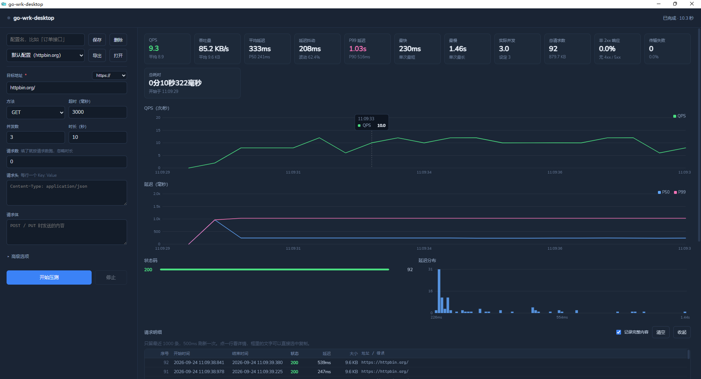
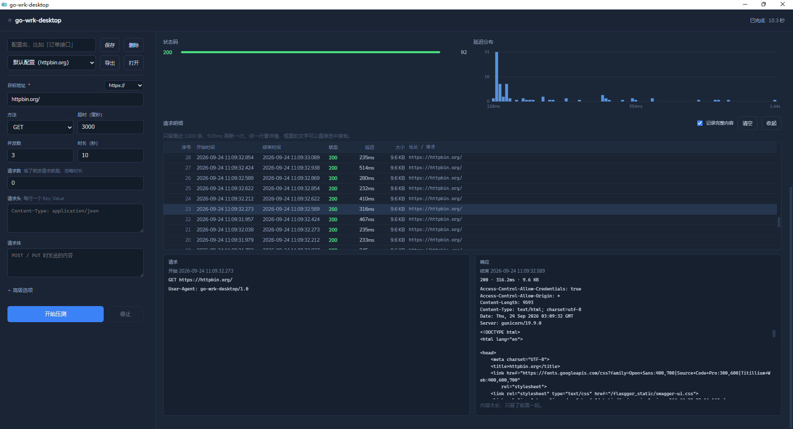
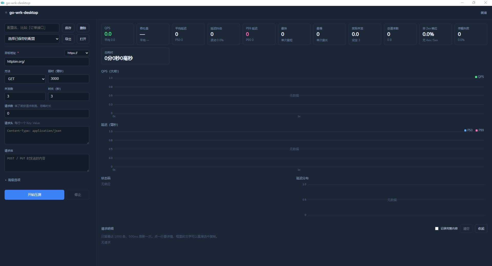

# go-wrk-desktop

go-wrk-desktop 桌面端 HTTP 压测/基准测试工具。Go + Wails + Vue 3。

## 下载

支持 Windows 10/11。到 [Releases](https://github.com/go-wrk/go-wrk/releases/latest) 页面下载最新的 exe，双击运行。

需要 WebView2 运行时 —— Win11 自带，Win10 可能要先[安装一下](https://developer.microsoft.com/microsoft-edge/webview2/)。

## 默认配置

启动后表单里已经填好这套参数，点「开始压测」即可开始：

| 参数 | 值 |
|---|---|
| 地址 | `https://httpbin.org/` |
| 方法 | GET |
| 并发数 | 3 |
| 时长 | 3 秒 |
| 超时 | 3000 毫秒 |

下拉列表里有一项内置的「默认配置」，选中即可恢复这套参数。它是内置的，无法删除；想留一套自己的参数，填个配置名再点「保存」。

## 许可

本项目参考 [go-wrk](https://github.com/tsliwowicz/go-wrk)（Apache License 2.0），命令行参数语义沿用，压测引擎为独立实现。
